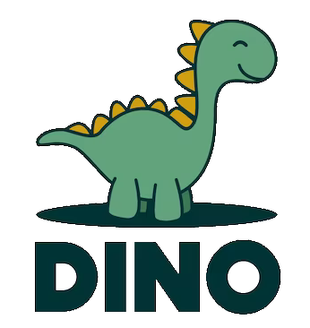

    
    :heart:
    

<h1 align="center">BreizhCamp Dino !</h1>

Bienvenue sur le projet du Dinosaure de Arche MC2, qui a vocation à être présenté sur le stand de l'entreprise au Breizhcamp.

Celui-ci servira d'animation, afin d'attirer les curieux et curieuses, discuter avec les développeurs présents, et éventuellement recruter ! :)

L'idée serait d'avoir une base rapidement travaillée, probablement orientée graphique (mais pourquoi pas ajouter un peu de back avec une API simple, notamment pour faire une base de multi joueur ?)

## Liste des pistes envisagées

- [Dinosaure Google (portage de l'ancien jeu qui apparaissait sur Chrome quand le navigateur était offline)](https://www.sololearn.com/compiler-playground/Wp4Z49xGlDBe/)
- [Dinosaure HTML / CSS, hyper simple, l'avantage est qu'on peut imaginer n'importe quoi ...](https://codepen.io/RobertMarshall/pen/NeOPPv)
- [Jeu Dino 3D, sur lib Three.js, joli mais trop compliqué ...](https://codepen.io/FRADAR/pen/zYZazBP)
- [Pacman revisité ?](https://github.com/8tentaculos/jsPacman)
