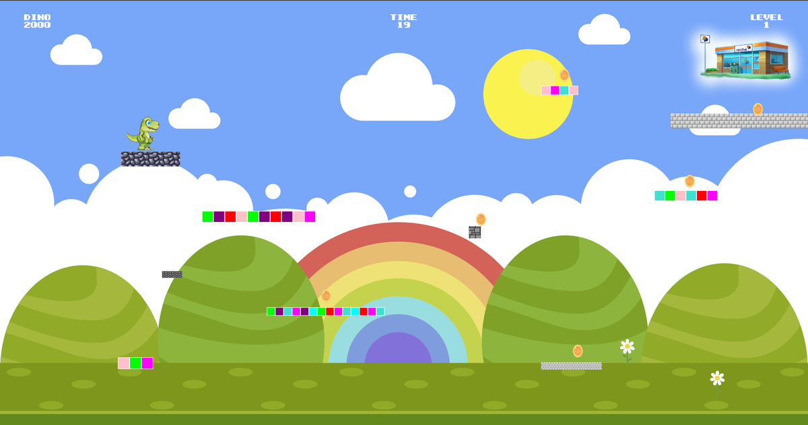

# _FromScratch

Petit projet avec un dino qui saute sur des plateformes ! Collectez des points et atteignez l'arrivée avant la fin du temps imparti, pour essayer de battre le meilleur score !

On espère le voir sur le stand de Arche MC2 au Breizhcamp :)

## Mise en place

### Pré-requis (installation de l'environnement)

- Installer Git (https://git-scm.com/)
- Installer Node.js (https://nodejs.org/en)
- Installer VS Code (https://code.visualstudio.com/)
- [Optional] Installer Terminal (https://apps.microsoft.com/store/detail/windows-terminal/9N0DX20HK701?hl=fr-fr&gl=fr)

### Commandes (dans un terminal)

```
1. git clone https://github.com/arche-mc2/breizhcamp-dino # pour récupérer ce projet
2. cd breizhcamp-dino/_from-scratch # se placer dans le projet
3. npm i # installe les dépendances
4. npm i -g sass # pour compiler les fichiers sass
5. webpack build && sass main.scss dist/main.css # compile les sources
```

6. [optional] si on veut avoir une compilation continue, pour laisser les gens jouer avec le code, ouvrir 2 terminaux avec un "webpack --watch" et l'autre "sass main.scss dist/main.css --watch"
___
## Screenshots :


